# HyperCOT-MS: Hypergraph Co-Optimal Transport for Morse-Smale Complex Comparison

This project compares **Morse-Smale (MS) complexes** extracted from clean and noisy sinusoidal surfaces using optimal transport methods, with a focus on **Hypergraph Co-Optimal Transport (HyperCOT)**.

## Overview

We compare three optimal transport approaches for MS complex comparison:

| Method | Features | Structure | Output |
|--------|----------|-----------|--------|
| **WD** (Wasserstein Distance) | Scalar field values | None | Node coupling |
| **GWD** (Gromov-Wasserstein Distance) | None | Graph distances | Node coupling |
| **HyperCOT** | Node measure (μ) | Hypergraph structure (ω) | Node coupling (π) + Region coupling (ξ) |

---

## Data Pipeline

### Step 1: Original Sinusoidal Surfaces

The input data is generated from a **sinusoidal scalar field** defined on a 2D grid:

$$f(x, y) = \sin(x) \cdot \cos(y)$$

Two variants are created:
- **Clean surface**: Original sinusoidal function
- **Noisy surface**: Sinusoidal + Gaussian noise

| Clean Sinusoidal Surface | Noisy Sinusoidal Surface |
|--------------------------|--------------------------|
|  | 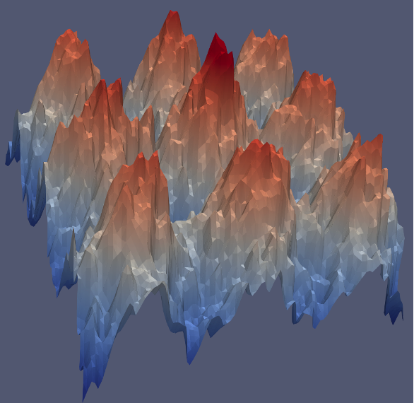 |

### Step 2: TTK Processing → MS Complex

The [Topology ToolKit (TTK)](https://topology-tool-kit.github.io/) extracts the Morse-Smale complex from each surface:

**TTK Output Files:**
- `*_critical_points.csv` — Critical points (minima, saddles, maxima)
- `*_separatrices_cells.csv` — Separatrices (gradient flow lines)
- `*_segmentation.csv` — Region segmentation

| Clean MS Complex | Noisy MS Complex |
|------------------|------------------|
| 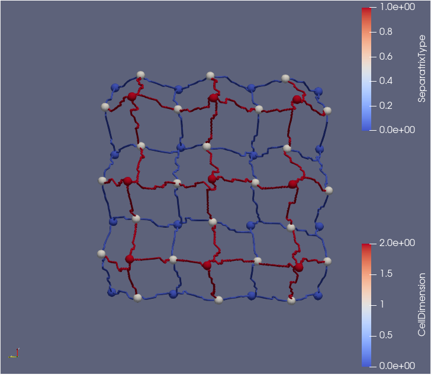 | 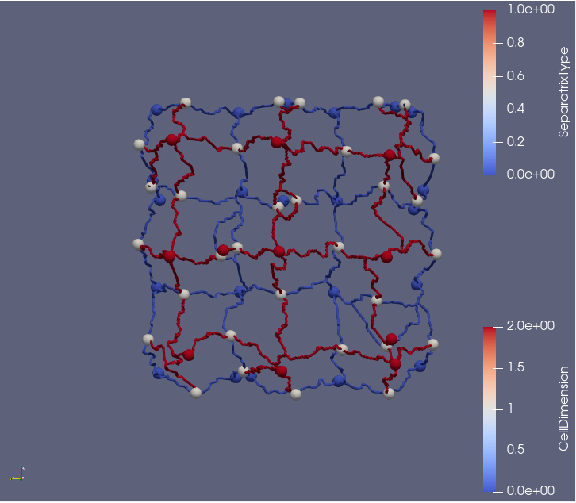 |

**Legend:**
- 🔵 Blue spheres = Minima (CellDimension=0)
- ⚪ White spheres = Saddles (CellDimension=1)
- 🔴 Red spheres = Maxima (CellDimension=2)
- Blue lines = Descending separatrices (saddle→min)
- Red lines = Ascending separatrices (saddle→max)

---

## Input Data Description (from TTK)

### Critical Points (`*_critical_points.csv`)

| Column | Description | Used By |
|--------|-------------|---------|
| `Point ID` | Unique vertex identifier | All methods |
| `CellDimension` | CP type: 0=min, 1=saddle, 2=max | Type analysis |
| `data` | **Scalar field value** at CP | **WD** |
| `Points_0`, `Points_1`, `Points_2` | (x, y, z) coordinates | GWD, HyperCOT |
| `CellId` | Cell identifier for connectivity | Graph construction |

### Separatrices (`*_separatrices_cells.csv`)

| Column | Description | Used By |
|--------|-------------|---------|
| `SeparatrixId` | Unique separatrix identifier | **GWD**, HyperCOT |
| `SourceId` | Source CP (CellId) | Graph edges |
| `DestinationId` | Destination CP (CellId) | Graph edges |
| `SeparatrixType` | 0=descending, 1=ascending | Edge classification |

### Segmentation (`*_segmentation.csv`)

| Column | Description | Used By |
|--------|-------------|---------|
| `MorseSmaleManifold` | Region identifier | **HyperCOT** |
| `DescendingManifold` | Associated minimum (Point ID) | Hypergraph |
| `AscendingManifold` | Associated maximum (offset needed) | Hypergraph |

---

## Methods

### Wasserstein Distance (WD)

WD computes optimal transport using **scalar field values** as point cloud features.

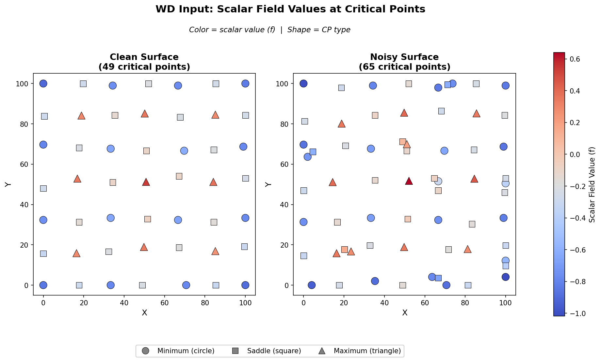

#### Formulation

Given critical points with scalar field values $\{f_i\}_{i=1}^{n_1}$ and $\{f_j\}_{j=1}^{n_2}$:

**Cost Matrix:**
$$C_{ij}^{\text{WD}} = |f_i - f_j|$$

**Probability Measures:**
$$\mu_i = \frac{1}{n_1}, \quad \nu_j = \frac{1}{n_2}$$

**Optimization:**
$$\text{WD} = \min_{\pi \in \Pi(\mu, \nu)} \sum_{i,j} C_{ij}^{\text{WD}} \cdot \pi_{ij}$$

where $\Pi(\mu, \nu)$ is the set of couplings with marginals $\mu$ and $\nu$.

**Output:** `wd_correspondence_refined.png`

---

### Gromov-Wasserstein Distance (GWD)

GWD computes optimal transport based on **graph structure**, comparing pairwise distances within each MS complex.

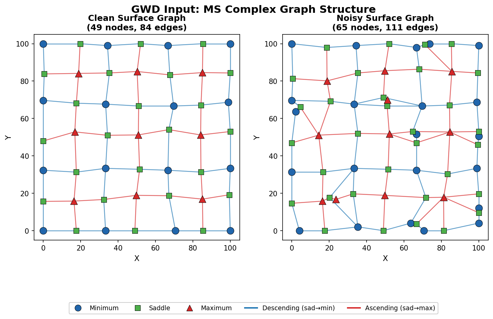

#### Formulation

**Intra-graph Distance:** Dijkstra shortest path on the separatrix graph with Euclidean edge weights:
$$d(i, j) = \text{ShortestPath}(i, j) \quad \text{with edge weight } w_{ij} = \|p_i - p_j\|_2$$

**Cost Tensor:**
$$L_{ijkl} = |d_1(i, j) - d_2(k, l)|^2$$

where $d_1$, $d_2$ are shortest path distances in clean and noisy graphs.

**Probability Measures:**
$$\mu_i = \frac{1}{n_1}, \quad \nu_j = \frac{1}{n_2}$$

**Optimization:**
$$\text{GWD} = \min_{\pi \in \Pi(\mu, \nu)} \sum_{i,j,k,l} L_{ijkl} \cdot \pi_{ik} \cdot \pi_{jl}$$

**Output:** `gwd_point_edge_correspondence.png`

---

### Hypergraph Co-Optimal Transport (HyperCOT)

HyperCOT extends optimal transport to **hypergraphs**, jointly optimizing node and hyperedge couplings. This is the main focus of this project.

#### Citation

> **Hypergraph co-optimal transport: metric and categorical properties**
> Samir Chowdhury, Tom Needham, Ethan Semrad, Bei Wang, and Youjia Zhou.
> *Journal of Applied and Computational Topology*, 2023.

#### Hypergraph Construction

Each **region** in the MS complex segmentation becomes a **hyperedge** containing:
- 1 minimum
- 2 saddles (on the boundary)
- 1 maximum

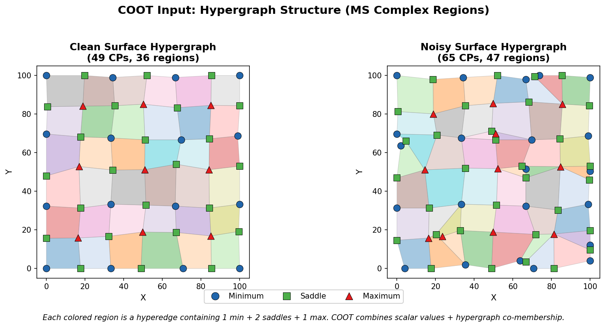

This is computed by `generate_hypergraph.py` from TTK segmentation data.

**Output CSV (`hypergraph_*.csv`):**

| Column | Description |
|--------|-------------|
| `region_id` | Hyperedge identifier (1-indexed) |
| `min_id` | CP index of minimum |
| `max_id` | CP index of maximum |
| `num_saddles` | Number of boundary saddles |
| `boundary_saddles` | List of saddle CP indices |
| `hyperedge` | Complete list: [min, saddles..., max] |
| `hyperedge_size` | Total CPs in hyperedge |
| `region_size` | Number of mesh vertices in region |

#### Formulation

Given two MS complex hypergraphs $\mathcal{H}_1 = (V_1, E_1)$ and $\mathcal{H}_2 = (V_2, E_2)$, HyperCOT solves:

$$\min_{\pi, \xi} \sum_{v \in V_1} \sum_{v' \in V_2} \sum_{e \in E_1} \sum_{e' \in E_2} |\omega_1(v,e) - \omega_2(v',e')|^2 \cdot \pi(v,v') \cdot \xi(e,e')$$

**Subject to:**
- $\pi \in \Pi(\mu_1, \mu_2)$ — node coupling with marginals $\mu_1, \mu_2$
- $\xi \in \Pi(\nu_1, \nu_2)$ — hyperedge coupling with marginals $\nu_1, \nu_2$

#### Input Components

HyperCOT requires three components for each hypergraph:

| Component | Symbol | Description | Computation |
|-----------|--------|-------------|-------------|
| Node measure | $\mu$ | Probability distribution over CPs | Extended persistence + Persistence image |
| Hyperedge measure | $\nu$ | Probability distribution over regions | Sum of boundary CP measures |
| Hypernetwork function | $\omega$ | **Distance from CP to region** | Dijkstra shortest path on augmented hypergraph |

---

#### Node Measure (μ) — `compute_node_measure.py`

The node measure captures topological importance via **extended persistence**:

1. **Build simplicial complex** from CP graph using z-values as filtration
2. **Compute extended persistence diagram** using GUDHI
3. **Generate persistence image** $I_f$ with Gaussian kernel:
   $$I_f(x) = \sum_{(b,p) \in \text{Dgm}} p \cdot \phi_\sigma(x - (b,p))$$
4. **Compute node contribution:**
   $$C(v) = \sum_k I_f[k] \cdot \phi_{(b_v, p_v)}(c_k)$$
5. **Normalize:** $\mu(v) = C(v) / \sum_{v'} C(v')$

**Clean Extended Persistence Diagram + Persistence Image + Node Measure:**
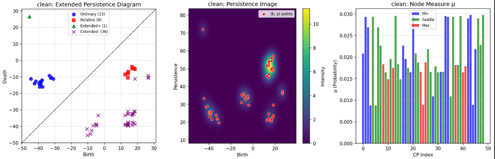

**Noisy Extended Persistence Diagram + Persistence Image + Node Measure:**
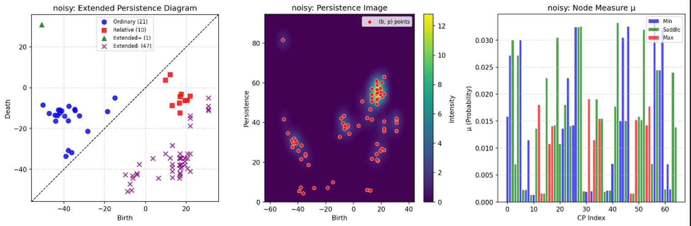

**Output:** `*_node_measure.csv`

---

#### Hyperedge Measure (ν) — `compute_nu.py`

$$\nu(e) = \frac{\sum_{v \in \partial e} \mu(v)}{\sum_{e'} \sum_{v \in \partial e'} \mu(v)}$$

where $\partial e$ denotes the boundary CPs of hyperedge $e$.

**Output:** `*_nu.csv`

---

#### Hypernetwork Function (ω) — `compute_omega.py`

$\omega(v, e)$ = **shortest path distance from critical point $v$ to region $e$**

Since a region is an area (not a single point), we approximate it using a **virtual center (VC)**:

**Virtual Center Computation:**
- Intersection point of the (min, max) line and (saddle₁, saddle₂) line
- Computed in 2D (x, y), then z is interpolated

**Augmented Hypergraph Construction:**

```
Nodes: CPs ∪ Virtual Centers (VCs)

Edges (with L2 distance weights):
  1. CP ↔ CP    : Separatrices (from TTK)
  2. CP ↔ VC    : Boundary CPs connect to their region's VC
  3. VC ↔ VC    : Adjacent regions (sharing boundary CPs)
```

**Shortest Path via Dijkstra:**

$$\omega(v, e) = \text{Dijkstra}(v, \text{VC}_e) \quad \text{on augmented hypergraph}$$

Returns $\omega$ matrix of shape $(n_{\text{CPs}} \times n_{\text{regions}})$.

**Augmented Graph with VC-VC Adjacency + Example Shortest Path:**
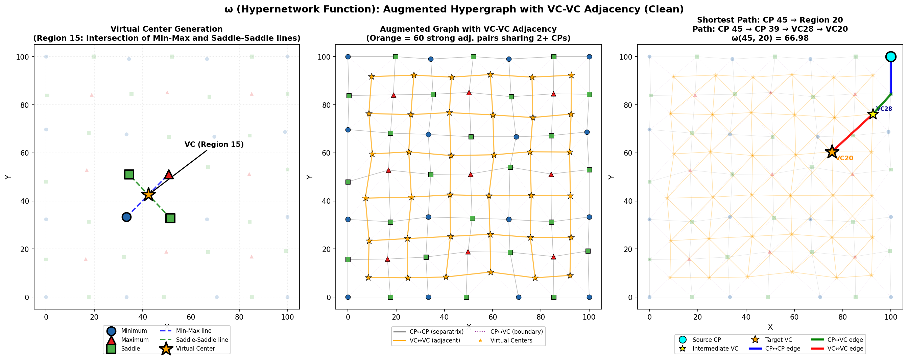

*Left: Virtual center generation (intersection of min-max and saddle-saddle lines). Middle: Augmented graph showing CP↔CP (gray), and VC↔VC (orange, only strong adjacencies sharing 2+ CPs). Right: Example shortest path from CP 45 to Region 20, with intermediate VCs highlighted in yellow.*

**Output:** `*_omega.csv`, `*_virtual_centers.csv`, `*_vc_adjacency.csv`

**Visualization:** Run `visualize_vc_adjacency.py` to generate `*_vc_adjacency.png`

---

#### Optimization — `compute_hypercot.py`

**Algorithm:** Alternating Sinkhorn iteration with entropy regularization

```
Initialize: π = μ₁ ⊗ μ₂,  ξ = ν₁ ⊗ ν₂

Repeat until convergence:
    1. Fix ξ, update π via Sinkhorn on cost:
       C_π[v,v'] = Σ_{e,e'} |ω₁(v,e) - ω₂(v',e')|² · ξ(e,e')

    2. Fix π, update ξ via Sinkhorn on cost:
       C_ξ[e,e'] = Σ_{v,v'} |ω₁(v,e) - ω₂(v',e')|² · π(v,v')
```

**Regularization:** $\epsilon = 0.05$

**Output:**
- `hypercot_pi.csv` — Node coupling matrix (n₁ × n₂)
- `hypercot_xi.csv` — Hyperedge coupling matrix (m₁ × m₂)
- `hypercot_summary.csv` — Distance and metrics

---

## Results

### Data Summary

| Dataset | Critical Points | Minima | Saddles | Maxima | Regions |
|---------|-----------------|--------|---------|--------|---------|
| Clean   | 49              | 16     | 24      | 9      | 36      |
| Noisy   | 65              | 22     | 32      | 11     | 47      |

### Method Comparison

| Method | Distance | Type Preservation |
|--------|----------|-------------------|
| WD     | 0.0402   | 90.0%             |
| GWD    | 0.0037   | 72.5%             |
| HyperCOT | 0.0024 | 85.7%            |

### Output Visualizations

#### Wasserstein Distance (WD)
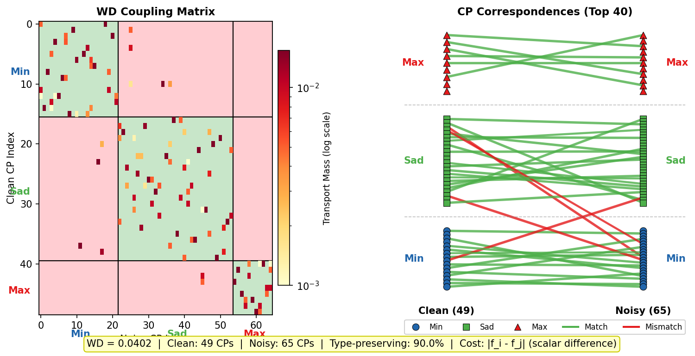

#### Gromov-Wasserstein Distance (GWD)
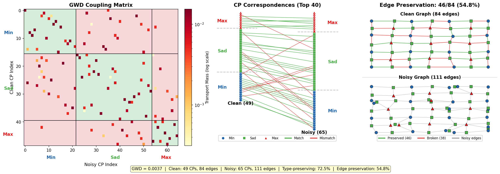

#### HyperCOT
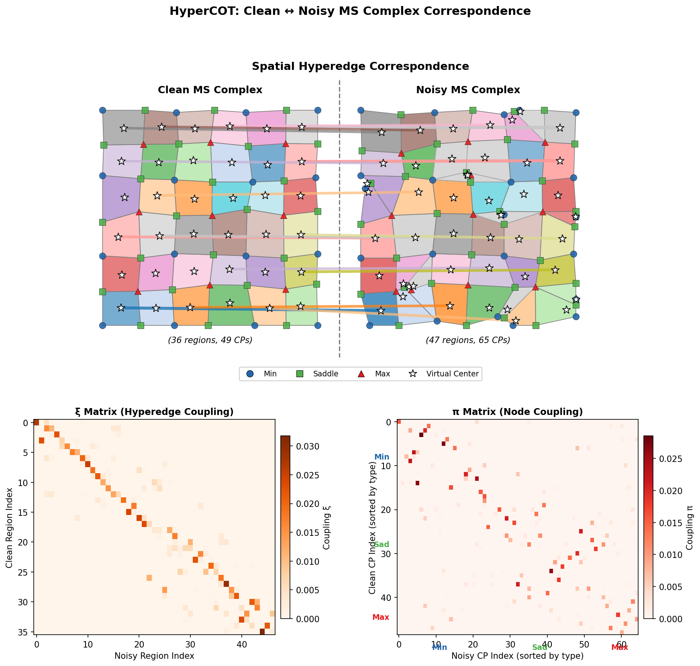

---

## Installation

### Dependencies

```bash
pip install numpy pandas scipy matplotlib gudhi
```

**Required packages:**
| Package | Purpose |
|---------|---------|
| `numpy` | Numerical computation |
| `pandas` | Data manipulation |
| `scipy` | Dijkstra shortest path, optimization |
| `matplotlib` | Visualization |
| `gudhi` | Extended persistence computation |

### Optional: TTK Installation

To regenerate input data from raw scalar fields, install [TTK](https://topology-tool-kit.github.io/installation.html).

---

## Usage

### Quick Start

Run all methods in sequence:

```bash
# 1. Generate hypergraph from TTK segmentation
python generate_hypergraph.py

# 2. Compute WD and GWD
python ms_complex_comparison.py

# 3. Visualize WD results
python visualize_wd_correspondence.py

# 4. Visualize GWD results
python visualize_gwd_correspondence.py

# 5. Compute HyperCOT components
python compute_node_measure.py    # μ (node measure) + persistence diagrams
python compute_nu.py              # ν (hyperedge measure)
python compute_omega.py           # ω (hypernetwork function)
python visualize_vc_adjacency.py  # VC generation + augmented graph visualization

# 6. Run HyperCOT optimization
python compute_hypercot.py

# 7. Visualize HyperCOT results
python visualize_hypercot_final.py
```

### Script Descriptions

| Script | Description | Input | Output |
|--------|-------------|-------|--------|
| `generate_hypergraph.py` | Build hypergraph from MS segmentation | `*_segmentation.csv`, `*_separatrices_cells.csv` | `hypergraph_*.csv`, `coot_input.png` |
| `ms_complex_comparison.py` | Compute WD and GWD | `*_critical_points.csv`, `*_separatrices_cells.csv` | Distance values |
| `compute_node_measure.py` | Compute μ via persistence | `*_critical_points.csv`, `*_separatrices_cells.csv` | `*_node_measure.csv` |
| `compute_nu.py` | Compute ν from μ | `*_node_measure.csv`, `hypergraph_*.csv` | `*_nu.csv` |
| `compute_omega.py` | Compute ω via Dijkstra | All CSV files | `*_omega.csv`, `*_virtual_centers.csv`, `*_vc_adjacency.csv` |
| `visualize_vc_adjacency.py` | Visualize VC generation + augmented graph | ω output files | `*_vc_adjacency.png` |
| `compute_hypercot.py` | HyperCOT optimization | μ, ν, ω files | `hypercot_pi.csv`, `hypercot_xi.csv`, `hypercot_summary.csv` |

---

## File Structure

```
├── README.md
├── CLAUDE.md                          # Project notes
│
├── Original Surfaces
│   ├── clean_input_ori.png            # Clean sinusoidal surface
│   └── noise_input_ori.png            # Noisy sinusoidal surface
│
├── TTK Output (MS Complex)
│   ├── clean_input.png                # Clean MS complex visualization
│   ├── noise_input.png                # Noisy MS complex visualization
│   ├── clean_critical_points.csv      # Clean CPs
│   ├── noisy_critical_points.csv      # Noisy CPs
│   ├── clean_separatrices_cells.csv   # Clean edges
│   ├── noisy_separatrices_cells.csv   # Noisy edges
│   ├── clean_segmentation.csv         # Clean regions
│   └── noisy_segmentation.csv         # Noisy regions
│
├── Scripts
│   ├── generate_hypergraph.py         # Hypergraph construction
│   ├── ms_complex_comparison.py       # WD & GWD computation
│   ├── compute_node_measure.py        # μ computation
│   ├── compute_nu.py                  # ν computation
│   ├── compute_omega.py               # ω computation
│   ├── visualize_vc_adjacency.py      # VC adjacency visualization
│   ├── compute_hypercot.py            # HyperCOT optimization
│   ├── visualize_wd_correspondence.py
│   ├── visualize_gwd_correspondence.py
│   └── visualize_hypercot_final.py
│
├── Intermediate Data
│   ├── hypergraph_clean.csv           # Clean hyperedges
│   ├── hypergraph_noisy.csv           # Noisy hyperedges
│   ├── clean_node_measure.csv         # μ for clean
│   ├── noisy_node_measure.csv         # μ for noisy
│   ├── clean_nu.csv                   # ν for clean
│   ├── noisy_nu.csv                   # ν for noisy
│   ├── clean_omega.csv                # ω for clean
│   ├── noisy_omega.csv                # ω for noisy
│   ├── clean_virtual_centers.csv      # VC coordinates
│   └── clean_vc_adjacency.csv         # VC-VC adjacency
│
├── Visualizations
│   ├── wd_input.png                   # WD input (scalar values)
│   ├── gwd_input.png                  # GWD input (graph structure)
│   ├── coot_input.png                 # HyperCOT input (hypergraph)
│   ├── clean_extended.png             # Clean: persistence diagram + PI + μ
│   ├── noise_extended.png             # Noisy: persistence diagram + PI + μ
│   ├── clean_vc_adjacency.png         # Clean: VC generation + augmented graph + shortest path
│   └── noisy_vc_adjacency.png         # Noisy: VC generation + augmented graph + shortest path
│
└── Output
    ├── wd_correspondence_refined.png
    ├── gwd_point_edge_correspondence.png
    ├── hypercot_detailed_correspondence.png
    ├── hypercot_pi.csv                # Node coupling
    ├── hypercot_xi.csv                # Hyperedge coupling
    └── hypercot_summary.csv           # Metrics
```

---

## References

1. **Hypergraph Co-Optimal Transport:**
   Chowdhury, S., Needham, T., Semrad, E., Wang, B., & Zhou, Y. (2023). *Hypergraph co-optimal transport: metric and categorical properties*. Journal of Applied and Computational Topology.

2. **Topology ToolKit (TTK):**
   Tierny, J., et al. (2018). *The Topology ToolKit*. IEEE Transactions on Visualization and Computer Graphics.

3. **Gromov-Wasserstein Distance:**
   Mémoli, F. (2011). *Gromov-Wasserstein distances and the metric approach to object matching*. Foundations of Computational Mathematics.

4. **Persistence Images:**
   Adams, H., et al. (2017). *Persistence images: A stable vector representation of persistent homology*. Journal of Machine Learning Research.

---

## License

MIT License
